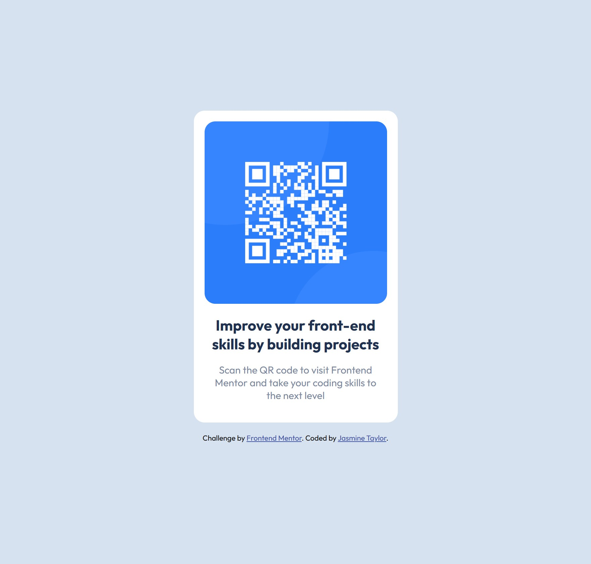
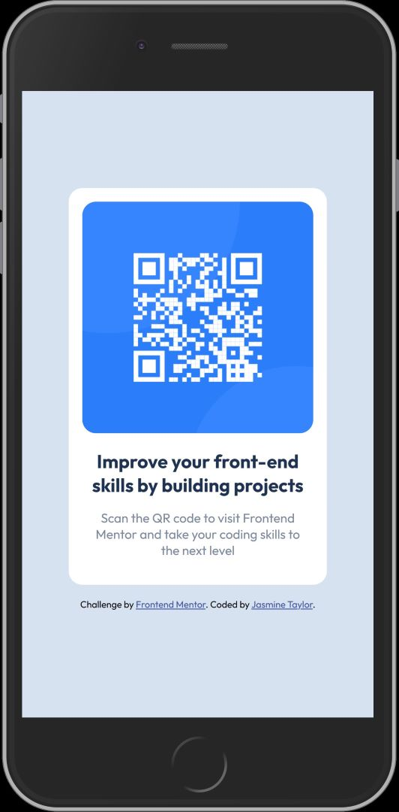

# Frontend Mentor - QR code component solution

This is a solution to the [QR code component challenge on Frontend Mentor](https://www.frontendmentor.io/challenges/qr-code-component-iux_sIO_H). Frontend Mentor challenges help you improve your coding skills by building realistic projects. 

## Table of contents

- [Overview](#overview)
  - [Screenshot](#screenshot)
  - [Links](#links)
- [My process](#my-process)
  - [Built with](#built-with)
  - [What I learned](#what-i-learned)
  - [Continued development](#continued-development)
  - [Useful resources](#useful-resources)
- [Author](#author)

## Overview

### Screenshot




### Links

- Solution URL: [Here](https://github.com/codewithjazzy/QR-code-component-challenge)
- Live Site URL: [Here](https://codewithjazzy-qr-challenge.netlify.app/)

## My process

### Built with

- Semantic HTML5 markup
- CSS custom properties
- Flexbox


### What I learned

I'm more comfortable with CSS Box Model, so utilizing Flexbox here took me out of my comfort zone. Luckily there are games that teach this method and lots of colorful cheatsheets. 
I used Em and Rem units in CS, exclusively. I had some familiarity with them, but pixels felt safer so I ended up using a converter for these values. It was interesting to learn that pixels are NOT recommended for sizing, like ever.
Last, but not least, I learned about viewports and the VH unit. I struggled for quite some time getting my responsive site to take up the entire space of the page. I intially started with a percentage value for the body height but it still wouldn't fill the page. Before this challenge, I didn't know what 'viewport height' was.


```css
body {
    background: hsl(212, 45%, 89%);
    font-size: 15px;
    font-family: 'Outfit', sans-serif;
    text-align: center;
    display: flex;
    flex-direction: column;
    align-items: center;
    justify-content: center;
    height: 100vh;
}


.card{
    background: hsl(0, 0%, 100%);
    border-radius: 1rem;
    max-width: 17rem;
    padding: 1rem;
    margin-bottom: 1rem;
}
```


### Continued development

Looking forward to understanding Flexbox with the same confidence I currently have in the Box Model. 
Also will be improving my documentation and familiarity with Git and Github.

### Useful resources

- [Using em vs. rem in CSS](https://blog.logrocket.com/using-em-vs-rem-css/#:~:text=em%20is%20a%20CSS%20unit,relative%20to%20a%20set%20value.) - This served as a refresher for em vs. rem and scalability. 
- [PX to REM Converter](https://codebeautify.org/px-to-rem-converter) - Additional resource to help me with leaving pixels behind and converting them to scalable units, easily.
- [A Complete Guide to Flexbox](https://css-tricks.com/snippets/css/a-guide-to-flexbox/) - Helpful guide with illustrations of flexbox properties.


## Author
- Frontend Mentor - [@codewithjazzy](https://www.frontendmentor.io/profile/codewithjazzy)
- Twitter - [@CodeWithJazzy](https://twitter.com/CodeWithJazzy)
